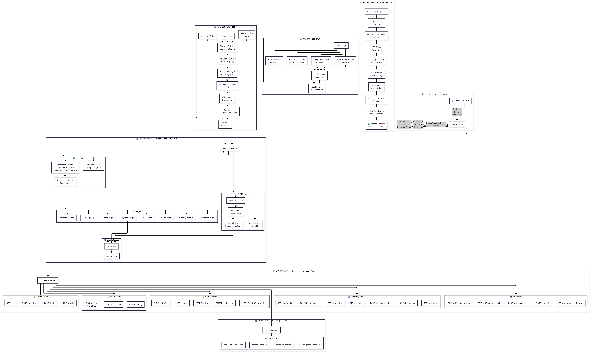
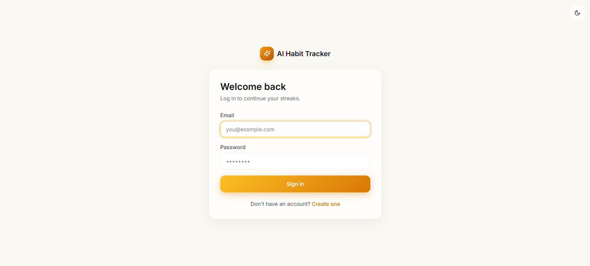
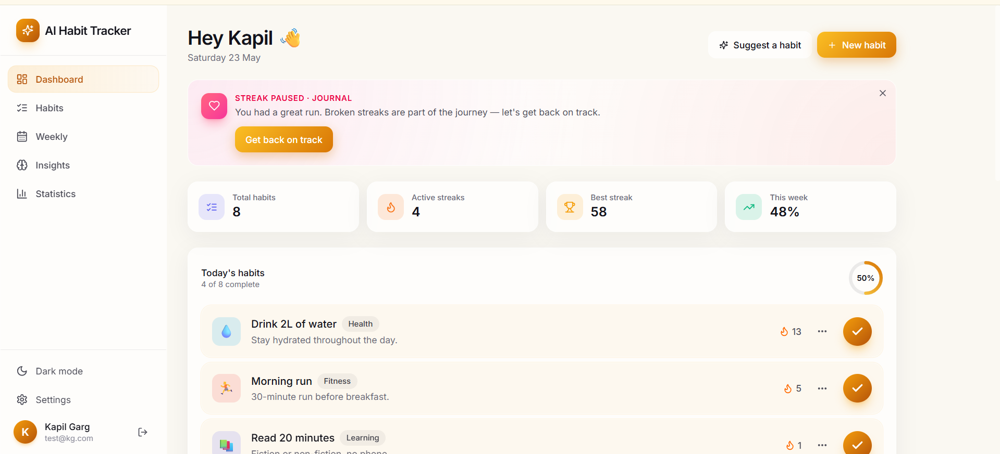
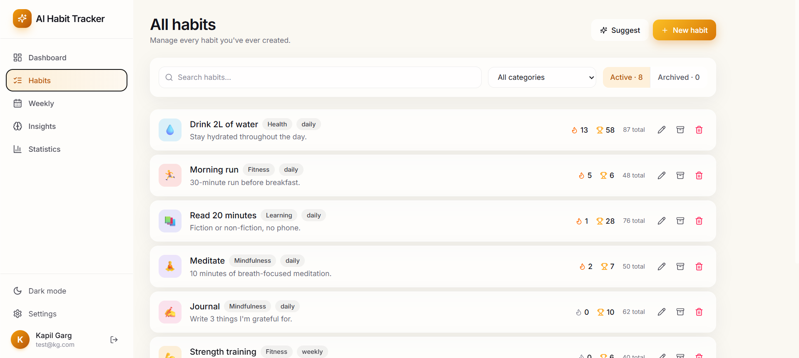
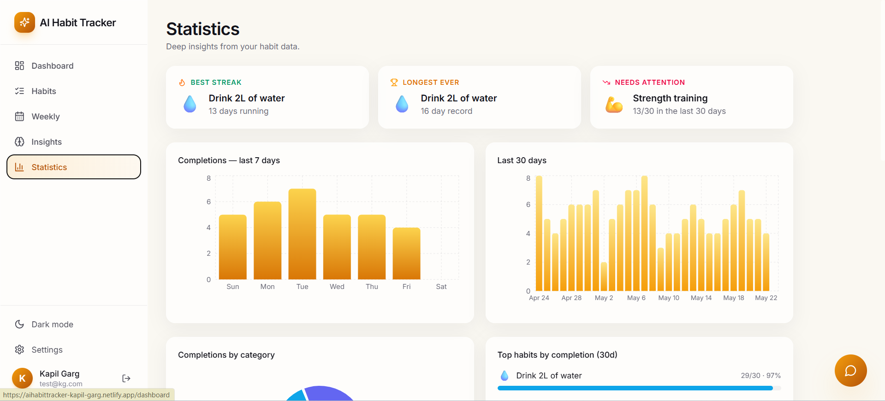

# AI Habit Tracker

An AI-powered full-stack MERN application that helps users build consistency, track habits, analyze productivity trends, and receive personalized AI-generated insights.

## Live Demo

Frontend:
https://aihabittracker-kapil-garg.netlify.app

---

# 🏗️ System Architecture



---

# 📸 Application Screenshots

---

## 🏠 Landing Page


---

## 🔑 Login Page



---

## 📋 Dashboard



---

## 🎯 Habit Management



---

## 📈 Statistics & Analytics



---

## 🤖 AI Insights

)

---

## Features

- User Authentication
- Habit Creation & Tracking
- Daily Progress Monitoring
- AI-Based Suggestions
- Secure JWT Authentication
- Responsive UI

---

## Tech Stack

### Frontend
- React
- Vite
- Axios
- CSS

### Backend
- Node.js
- Express.js
- MongoDB Atlas
- JWT Authentication

### Deployment
- Netlify (Frontend)
- Render (Backend)

---

## Project Structure

```bash
aihabittracker/
│
├── backend/
│   ├── controllers/
│   ├── middleware/
│   ├── models/
│   ├── routes/
│   ├── utils/
│   ├── .env
│   ├── package.json
│   └── server.js
│
├── frontend/
│   ├── public/
│   │   └── _redirects
│   │
│   ├── src/
│   │   ├── api/
│   │   ├── components/
│   │   ├── pages/
│   │   └── App.jsx
│   │
│   ├── .env
│   ├── package.json
│   └── vite.config.js
│
├── screenshots/
│   ├── architecture.png
│   ├── documentation.png
│   ├── landing.png
│   ├── login.png
│   ├── dashboard.png
│   ├── habits.png
│   ├── stats.png
│   └── insights.png
│
├── README.md
└── .gitignore
```

---

## Installation

### Clone Repository

```bash
git clone https://github.com/kapilgarg9358/aihabittracker.git
```

### Backend Setup

```bash
cd backend
npm install
npm start
```

### Frontend Setup

```bash
cd frontend
npm install
npm run dev
```

---

## Environment Variables

Backend `.env`

```env
MONGO_URI=
JWT_SECRET=
CLIENT_URL=
```

---

## Author

Kapil Garg